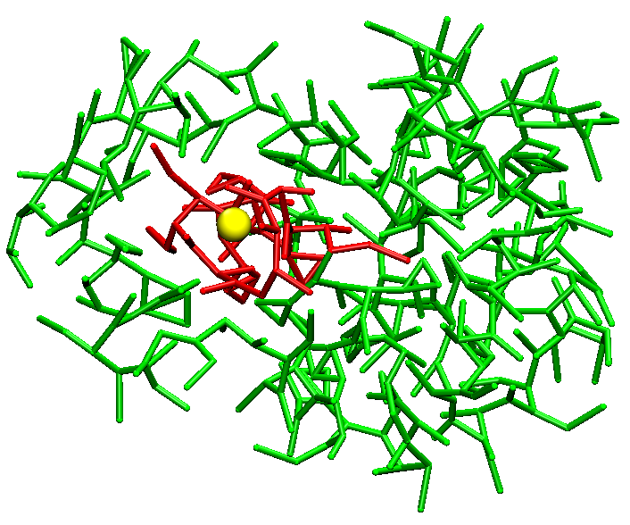
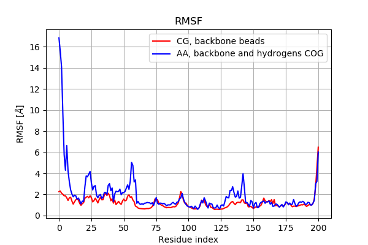
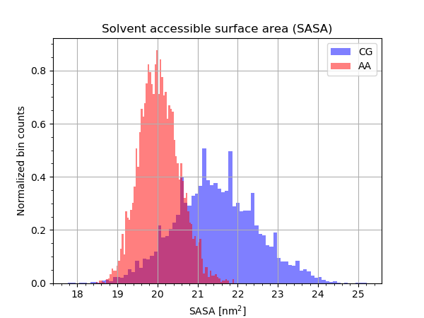

# Multiscale Methods project

The repository contains a short CG simulation of a Recoverin protein in aqueous environment. 

*Representation of the non-myristoylated Recoverin with its EF2 pocket highlighted in red.*

Below, some of the main quantities obtained from the CG simulation. 

*Root Mean Square Fluctuation comparison between all-atom (AA) and coarse-grained (CG) systems*

*Solvent accessible surface area (SASA) of the binding pocket EF2 for AA and CG systems.*